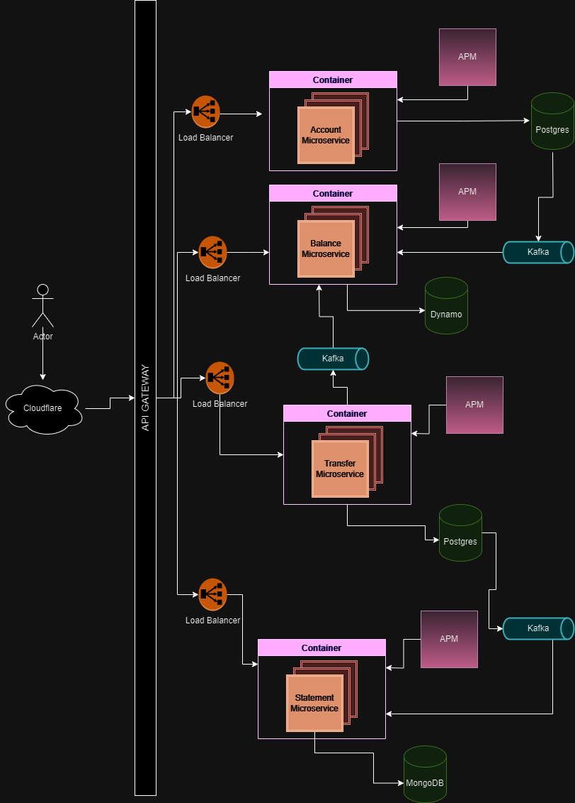

# Event Driven Architecture
An Event Driven Architecture example for microservices.

## Intro
This project is solely for study purposes and is intentionally kept very simple.
It ignores authentication and other important aspects; it is not a template or a guide.
It merely aims to put into practice some techniques and best practices focused on achieving resilience, 
scalability and reliability between microservices.

## Architecture desired

## Technologies
* Accounts Service:
  * Java
  * Spring
* Balances Service:
  * NodeJS
  * Express
* Transfers Service:
  * Golang
  * Gin
* Statements Service:
  * Python
  * Fast-api
* Miscellaneous
  * Kubernetes
  * Istio Service Mesh
  * Apache Kafka
  * API Gateway
  * CloudFlare
  * Docker
  * Docker-Compose
  * Postgres SQL
  * DynamoDB
  * MongoDB
  * Some APM(application monitoring services) to be defined
